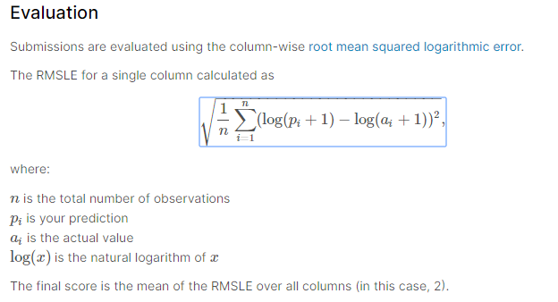

# COVID19 Global Forecasting (Week 1)

현재 전 세계적으로 퍼지고 있는 바이러스를 주제로 확진자를 예측하는 컴피티션

 - 주소: https://www.kaggle.com/c/covid19-global-forecasting-week-1/overview/evaluation

- 일정: 2020년 03월 25일 
- 평가방식: RMSLE

- 목표: 캐글에 업로드 된 커널 하나를 선정하여 필사하는 것을 목표로 한다.

## 최근 일지(03월 20일 최종 수정)

 - 계획:

 - 달성 내용:

  

### 스터디 내용
---
#### 1. 03월 20일(수정중)
 - 목표:
	- 캐글에 업로드 되어 있는 커널 하나 선정
	- 커널에 작성되어있는 코드를 따라 작성 후 제출하여 score 얻기

 - 분석한 커널:
	- [eda-for-ashrae](https://github.com/madfalc0n/kaggle_project/blob/master/great_energy_predict/notebook/20191114/EDA_or_Model%20apply.ipynb)
	- [simple-linear-regression-benchmark](https://github.com/madfalc0n/kaggle_project/blob/master/great_energy_predict/notebook/20191112/Simple%20Linear%20Regression%20Benchmark.ipynb)

 - 달성한 내용:
	- 커널에 작성되어 있는 코드를 따라 적어보며 전반적인 데이터 분석을 위한 EDA 과정과 모델(simple linear regression) 사용하는 방법에 대한 습득
	- Public score 1.88 달성

- 